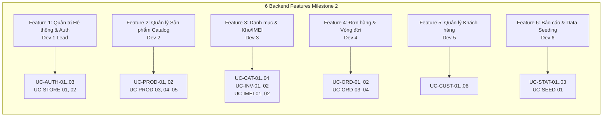
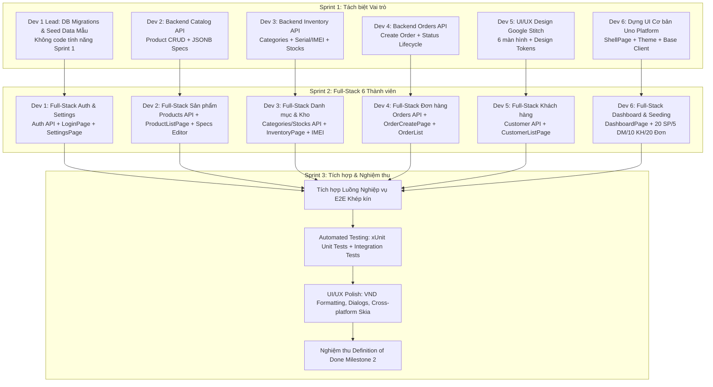

# KẾ HOẠCH TRIỂN KHAI MILESTONE 2: HOÀN THIỆN PHÂN HỆ QUẢN TRỊ (ADMIN)

**Dự án:** TechStore Management System  
**Mục tiêu:** Hoàn thiện toàn diện Phân hệ Quản trị (Admin - Bảng 1 trong `docs/ROADMAP.md`) với kiến trúc 3-Tier API-First (.NET 10 Web API + Uno Platform WinUI 3 Desktop + PostgreSQL 16).  
**Quy mô đội ngũ:** 6 Kỹ sư Phần mềm (Dev 1 Lead, Dev 2, Dev 3, Dev 4, Dev 5, Dev 6).  
**Tiến độ:** 3 Sprints.  

---

## Context
Nhóm đã hoàn thành Milestone 1 (Nền tảng, Kiến trúc & Cơ sở dữ liệu 21 bảng). Bước sang Milestone 2, mục tiêu là hiện thực hóa đầy đủ 6 chức năng Quản trị (Admin) cốt lõi: Quản trị Hệ thống/Tài khoản, Quản lý Sản phẩm & JSONB Specs, Quản lý Danh mục & Tồn kho/IMEI ban đầu, Tạo & Quản lý Đơn hàng, Quản lý Khách hàng, Báo cáo Thống kê & Dữ liệu Demo. Để tối ưu hóa nguồn lực và chất lượng giao diện, Sprint 1 phân hóa chuyên môn (1 Kỹ sư Design toàn hệ thống bằng Google Stitch, 1 Kỹ sư dựng Khung UI Uno Platform cơ bản, 1 Kỹ sư Lead quản lý DB & Seed data mẫu, 3 Kỹ sư tập trung code Backend API cốt lõi); sang Sprint 2 khi UI đã vững chắc, toàn bộ 6 Kỹ sư đồng loạt phát triển song song Full-Stack (Backend API + Frontend MVVM) theo từng phân hệ dọc; Sprint 3 dành trọn vẹn cho Tích hợp E2E, Kiểm thử Tự động (`xUnit`) và Nghiệm thu Definition of Done.

---

## Phân công Trách nhiệm Tổng thể 6 Kỹ sư (Ma trận Bảng 1 - ROADMAP)

| STT | Kỹ sư | Chức năng Phụ trách (Bảng 1) | Vai trò Sprint 1 (Chuyên môn hóa) | Vai trò Sprint 2 (Full-Stack Feature Slice) | Vai trò Sprint 3 (Tích hợp & QA) |
| :---: | :--- | :--- | :--- | :--- | :--- |
| **1** | **Dev 1 (Lead)** | **Quản trị Hệ thống & Tài khoản** | **Quản lý DB Migrations & Nạp Seed Data Mẫu** (Tạo migrations EF Core, nạp dữ liệu mẫu vừa đủ cho dev test, không code tính năng trong Sprint 1) | **Full-Stack Quản trị Hệ thống** (Auth/Store API, LoginPage, SettingsPage, hoàn thiện Shell) | Phụ trách Merge PR, Điều phối Solution, Tích hợp luồng Xác thực E2E |
| **2** | **Dev 2** | **Quản lý Sản phẩm (Catalog)** | **Backend Catalog API**: Tận dụng Entities/Schema M1, lập trình Service & Controller xử lý CRUD, tìm kiếm, lọc specs JSONB | **Full-Stack Sản phẩm**: `ProductListPage`, `ProductListViewModel`, `ProductDetailDialog` (Dynamic JSON Specs Editor) | Viết Unit Test Catalog (`ProductServiceTests`), kiểm thử ràng buộc giá, SKU và specs filter |
| **3** | **Dev 3** | **Danh mục & Tồn kho ban đầu** | **Backend Inventory & Categories API**: Tận dụng Entities/Schema M1, lập trình Service & Controller xử lý Cây danh mục, Tồn kho, nạp IMEI | **Full-Stack Danh mục & Kho**: `CategoryListPage` (Cây danh mục), `InventoryPage` (Tồn kho, nhập số dư đầu kỳ, bảng IMEI) | Viết Unit Test Kho (`InventoryServiceTests`), kiểm thử ràng buộc IMEI 15 số và tồn kho |
| **4** | **Dev 4** | **Tạo & Quản lý Đơn hàng** | **Backend Orders API**: Tận dụng Entities/Schema M1, lập trình Service & Controller xử lý Tạo đơn POS, tính tiền, khóa giữ chỗ IMEI | **Full-Stack Đơn hàng**: `OrderCreatePage` (Form chọn khách, SP, IMEI, tính tiền realtime), `OrderListPage`, `OrderDetailDialog` | Viết Unit Test Đơn hàng (`OrderServiceTests`), kiểm thử luồng trừ kho và đổi trạng thái IMEI |
| **5** | **Dev 5** | **Quản lý Thông tin Khách hàng** | **Lead UI/UX Designer (Google Stitch)**: Thiết kế toàn bộ 6 màn hình Admin, Design Tokens, Flow; Chuẩn bị Contract Khách hàng | **Full-Stack Khách hàng**: `ICustomerService`, `CustomersController`, `CustomerListPage`, `CustomerDetailDialog` (Lịch sử đơn) | Viết Unit Test Khách hàng (`CustomerServiceTests`), chuẩn hóa trải nghiệm UI/UX toàn hệ thống theo Stitch |
| **6** | **Dev 6** | **Thống kê Cơ bản & Dữ liệu Demo** | **Dựng UI Cơ bản Uno Platform** (ShellPage, NavigationView, Styles/Theme từ Stitch, Base Controls, Client Services) + Chuẩn bị Feature 6 | **Full-Stack Thống kê & Seeder**: DashboardPage, DashboardViewModel, StatCard KPI, Mở rộng Seeder nạp hoàn tất $\ge 20$ SP, $\ge 5$ DM, $\ge 10$ KH, $\ge 20$ đơn | Viết Integration Test (AdminApiIntegrationTests), kiểm tra đối soát số liệu Dashboard và Seeder |

---

## Phân rã Chi tiết Backend theo Features & Use Cases (Dành cho 6 Kỹ sư)

Toàn bộ các tác vụ Backend của Milestone 2 được cấu trúc thành **6 Features nghiệp vụ** (tương ứng 6 chức năng Admin trong Bảng 1 của `docs/ROADMAP.md`), phân rã thành **26 Use Cases độc lập**. Kế hoạch định danh rõ ràng mã Use Case và **Actor** thực hiện; toàn bộ chi tiết kỹ thuật (Request/Response DTOs, endpoint routes, thuật toán xử lý nội bộ) do từng kỹ sư phụ trách tự chủ động thiết kế và hiện thực hóa:

---

### Feature 1: Quản trị Hệ thống, Xác thực Admin & Cấu hình Cửa hàng (System & Store Management)
* **Kỹ sư phụ trách:** Dev 1 (Lead)
* **Module Server:** `backend/Identity/` & `backend/Common/`
* **Danh sách Use Cases:**
  * **`UC-AUTH-01: Đăng nhập Quản trị viên (Admin Login)`** — **Actor:** Admin
  * **`UC-AUTH-02: Lấy Profile Quản trị viên hiện tại (Current Admin Profile)`** — **Actor:** Admin
  * **`UC-AUTH-03: Đăng xuất Quản trị viên (Admin Logout)`** — **Actor:** Admin
  * **`UC-STORE-01: Lấy Cấu hình Thông tin Cửa hàng (Get Store Settings)`** — **Actor:** Admin
  * **`UC-STORE-02: Cập nhật Cấu hình Thông tin Cửa hàng (Update Store Settings)`** — **Actor:** Admin

---

### Feature 2: Quản lý Sản phẩm & Cấu hình Thông số Kỹ thuật JSONB (Catalog Management)
* **Kỹ sư phụ trách:** Dev 2
* **Module Server:** `backend/Catalog/`
* **Danh sách Use Cases:**
  * **`UC-PROD-01: Tìm kiếm & Lọc Danh sách Sản phẩm (Search & Filter Products)`** — **Actor:** Admin
  * **`UC-PROD-02: Xem Chi tiết Sản phẩm & Biến thể (Get Product Detail)`** — **Actor:** Admin
  * **`UC-PROD-03: Thêm mới Sản phẩm & Hardware Specs JSONB (Create Product)`** — **Actor:** Admin
  * **`UC-PROD-04: Cập nhật Thông tin & Hardware Specs (Update Product)`** — **Actor:** Admin
  * **`UC-PROD-05: Ngừng kinh doanh / Xóa Sản phẩm (Deactivate / Delete Product)`** — **Actor:** Admin

---

### Feature 3: Quản lý Danh mục & Tồn kho / Serial-IMEI Ban đầu (Category & Inventory Balance)
* **Kỹ sư phụ trách:** Dev 3
* **Module Server:** `backend/Catalog/` & `backend/Inventory/`
* **Danh sách Use Cases:**
  * **`UC-CAT-01: Lấy Cây Phân cấp Danh mục Sản phẩm (Category Hierarchy Tree)`** — **Actor:** Admin
  * **`UC-CAT-02: Thêm mới Danh mục (Create Category)`** — **Actor:** Admin
  * **`UC-CAT-03: Cập nhật Danh mục (Update Category)`** — **Actor:** Admin
  * **`UC-CAT-04: Xóa Danh mục (Delete Category)`** — **Actor:** Admin
  * **`UC-INV-01: Tra cứu Số dư Tồn kho Tổng hợp (Get Inventory Balances)`** — **Actor:** Admin
  * **`UC-INV-02: Khởi tạo Số dư Tồn kho Ban đầu (Initialize Opening Stock Balance)`** — **Actor:** Admin
  * **`UC-IMEI-01: Tra cứu Danh sách Serial/IMEI theo Thiết bị (Lookup Serial/IMEIs)`** — **Actor:** Admin
  * **`UC-IMEI-02: Nạp Danh sách Serial/IMEI Ban đầu (Batch Import Serial/IMEIs)`** — **Actor:** Admin

---

### Feature 4: Tạo & Quản lý Vòng đời Đơn hàng (Order Processing & Lifecycle)
* **Kỹ sư phụ trách:** Dev 4
* **Module Server:** `backend/Orders/`
* **Danh sách Use Cases:**
  * **`UC-ORD-01: Lập Đơn hàng Bán lẻ tại Quầy (Create Retail POS Order)`** — **Actor:** Admin
  * **`UC-ORD-02: Lấy Danh sách Đơn hàng (Get Order List with Filtering)`** — **Actor:** Admin
  * **`UC-ORD-03: Xem Chi tiết Đơn hàng (Get Order Detail)`** — **Actor:** Admin
  * **`UC-ORD-04: Cập nhật Trạng thái Đơn hàng (Transition Order Status)`** — **Actor:** Admin

---

### Feature 5: Quản lý Thông tin Khách hàng & Lịch sử Mua hàng (Customer Profile)
* **Kỹ sư phụ trách:** Dev 5
* **Module Server:** `backend/Customers/`
* **Danh sách Use Cases:**
  * **`UC-CUST-01: Tìm kiếm & Lấy Danh sách Khách hàng (Search & List Customers)`** — **Actor:** Admin
  * **`UC-CUST-02: Xem Chi tiết Khách hàng & Tích lũy (Get Customer Profile)`** — **Actor:** Admin
  * **`UC-CUST-03: Thêm mới Khách hàng (Create Customer)`** — **Actor:** Admin
  * **`UC-CUST-04: Cập nhật Thông tin Khách hàng (Update Customer)`** — **Actor:** Admin
  * **`UC-CUST-05: Tra cứu Lịch sử Mua hàng của Khách (Get Customer Purchase History)`** — **Actor:** Admin
  * **`UC-CUST-06: Vô hiệu hóa / Xóa Khách hàng (Deactivate / Delete Customer)`** — **Actor:** Admin

---

### Feature 6: Báo cáo Thống kê Doanh thu & Seeding Dữ liệu Demo (Analytics & Seeder)
* **Kỹ sư phụ trách:** Dev 6
* **Module Server:** `backend/Customers/` (Analytics) & `backend/Common/Data/` (Seeding)
* **Danh sách Use Cases:**
  * **`UC-STAT-01: Thống kê Tổng hợp Dashboard KPIs (Admin Dashboard Metrics)`** — **Actor:** Admin
  * **`UC-STAT-02: Lấy Hoạt động Đơn hàng Mới nhất & Tồn kho Thấp (Recent Activities)`** — **Actor:** Admin
  * **`UC-STAT-03: Thống kê Doanh thu theo Ngày (Daily Revenue Trends)`** — **Actor:** Admin
  * **`UC-SEED-01: Tự động Nạp Dữ liệu Mẫu Ban đầu (Automated Demo Data Seeding)`** — **Actor:** Hệ thống tự động / Admin

---

## Chi tiết Kế hoạch Thực hiện theo 3 Sprints

---

### SPRINT 1: Nền tảng UI/UX (Google Stitch), Khung Client Uno & Core Backend API
*Thời lượng dự kiến:* Sprint đầu tiên.  
*Mục tiêu cốt lõi:* Hoàn thiện thiết kế UI/UX trên Google Stitch; dựng khung giao diện Uno Platform cơ bản; tận dụng CSDL & Entities có sẵn từ Milestone 1 để hoàn thành toàn bộ API nghiệp vụ Backend cốt lõi.

#### 1. Dev 5 (Lead UI/UX Designer - Google Stitch & Chuẩn bị Phân hệ Khách hàng) - Vy 192
- **Nhiệm vụ Thiết kế UI/UX (Dùng Google Stitch - Không code trong Sprint 1):**
  - Sử dụng **Google Stitch** thiết kế bộ Prototype hoàn chỉnh cho toàn bộ Phân hệ Quản trị (Admin) gồm 6 màn hình:
    1. *Tổng quan Dashboard* (`UC-STAT-01`, `UC-STAT-02`, `UC-STAT-03`).
    2. *Quản lý Sản phẩm & Hardware Specs* (`UC-PROD-01` đến `UC-PROD-05`).
    3. *Danh mục & Quản lý Kho/IMEI* (`UC-CAT-01..04`, `UC-INV-01/02`, `UC-IMEI-01/02`).
    4. *Tạo & Quản lý Đơn hàng* (`UC-ORD-01` đến `UC-ORD-04`).
    5. *Quản lý Khách hàng* (`UC-CUST-01` đến `UC-CUST-06`).
    6. *Cài đặt Cửa hàng & Đăng nhập Admin* (`UC-AUTH-01..03`, `UC-STORE-01/02`).
  - Trích xuất **Design Tokens** (bảng màu chủ đạo, typography, bo góc, spacing grid) bàn giao cho Dev 6 để dựng khung XAML.
- **Nhiệm vụ Phân hệ Khách hàng (Feature 5):**
  - Khảo sát yêu cầu và chuẩn bị đặc tả trường dữ liệu cho các Use Cases: `UC-CUST-01` (Tìm kiếm & xem danh sách), `UC-CUST-02` (Xem chi tiết & tích lũy), `UC-CUST-03` (Thêm mới khách hàng).

#### 2. Dev 1 (Lead - Quản lý DB Migrations & Nạp Seed Data Mẫu Ban đầu) - An 207
- **Nhiệm vụ Quản trị Kỹ thuật & CSDL (Không code tính năng trong Sprint 1):**
  - Chạy và quản lý EF Core Database Migrations (`dotnet ef migrations add`, `dotnet ef database update`) đảm bảo cấu trúc 21 bảng đồng bộ chính xác trên PostgreSQL 16.
  - Chuẩn bị và nạp tập dữ liệu mẫu ban đầu trực tiếp vào PostgreSQL với số lượng vừa đủ để các dev khác có môi trường và dữ liệu test ngay (~5 sản phẩm, ~2 danh mục, ~2 khách hàng, ~2 đơn hàng, tài khoản Admin `admin` / `Admin@123`).
  - Hỗ trợ cả nhóm về thiết lập môi trường Docker, chuỗi kết nối và xử lý các vấn đề CSDL.

#### 3. Dev 2 (Backend Feature 2 - Lập trình C# Phân hệ Quản lý Sản phẩm) - Q.Vinh 202
- **Lập trình Backend API C# .NET 10 (Tận dụng Entities & Schema M1, code Service & Controller chạy trên Swagger):**
  - Kế thừa và sử dụng các thực thể `Product`, `ProductVariant` đã có từ Milestone 1.
  - Code logic Service và Controller API hoàn chỉnh cho các Use Cases đảm nhận:
    - `UC-PROD-01: Tìm kiếm & Lọc Danh sách Sản phẩm`
    - `UC-PROD-02: Xem Chi tiết Sản phẩm & Biến thể`
    - `UC-PROD-03: Thêm mới Sản phẩm & Hardware Specs JSONB`

#### 4. Dev 3 (Backend Feature 3 - Lập trình C# Phân hệ Danh mục & Tồn kho/IMEI) - Bình 218
- **Lập trình Backend API C# .NET 10 (Tận dụng Entities & Schema M1, code Service & Controller chạy trên Swagger):**
  - Kế thừa và sử dụng các thực thể `Category`, `InventoryStock`, `SerialImei`, `InventoryMovement` đã có từ Milestone 1.
  - Code logic Service và Controller API hoàn chỉnh cho các Use Cases đảm nhận:
    - `UC-CAT-01: Lấy Cây Phân cấp Danh mục Sản phẩm`
    - `UC-CAT-02: Thêm mới Danh mục`
    - `UC-INV-01: Tra cứu Số dư Tồn kho Tổng hợp`
    - `UC-INV-02: Khởi tạo Số dư Tồn kho Ban đầu`
    - `UC-IMEI-01: Tra cứu Danh sách Serial/IMEI theo Thiết bị`
    - `UC-IMEI-02: Nạp Danh sách Serial/IMEI Ban đầu`

#### 5. Dev 4 (Backend Feature 4 - Lập trình C# Phân hệ Tạo & Quản lý Đơn hàng) - Đạt 231
- **Lập trình Backend API C# .NET 10 (Tận dụng Entities & Schema M1, code Service & Controller chạy trên Swagger):**
  - Kế thừa và sử dụng các thực thể `Order`, `OrderItem` đã có từ Milestone 1.
  - Code logic Service và Controller API hoàn chỉnh cho các Use Cases đảm nhận:
    - `UC-ORD-01: Lập Đơn hàng Bán lẻ tại Quầy`
    - `UC-ORD-02: Lấy Danh sách Đơn hàng`
    - `UC-ORD-03: Xem Chi tiết Đơn hàng`
    - `UC-ORD-04: Cập nhật Trạng thái Đơn hàng`

#### 6. Dev 6 (Frontend Foundation - Lập trình XAML/C# Khung UI Uno Platform) - T.Vinh 190
- **Lập trình Frontend Uno Platform XAML + C# (Code thật Shell, Theme & Base Controls):**
  - Code giao diện chuẩn **Feature-First MVVM** trong `frontend/TechStore.Client/`:
    - `ShellPage.xaml` và `ShellViewModel.cs`: `NavigationView` Fluent Design với 6 menu tương ứng 6 phân hệ Admin.
    - XAML Styles & Resource Dictionaries nạp theo Design Tokens từ Stitch (`Colors.xaml`, `Styles.xaml`, `TextBlockStyles.xaml`).
    - Base Controls tái sử dụng: `StatCard`, `SearchBoxControl`, `EmptyStateControl`.
    - Nền tảng dịch vụ Client: Điều hướng màn hình, hộp thoại thông báo/xác nhận, Base HTTP Client (quản lý token và xử lý lỗi tập trung).
- **Nhiệm vụ Phân hệ Thống kê (Feature 6):**
  - Khảo sát các Use Cases chuẩn bị code trong Sprint 2:
    - `UC-STAT-01: Thống kê Tổng hợp Dashboard KPIs`
    - `UC-STAT-02: Lấy Hoạt động Đơn hàng Mới nhất & Tồn kho Thấp`
    - `UC-SEED-01: Tự động Nạp Dữ liệu Mẫu Ban đầu`

---

### SPRINT 2: Chuẩn hóa UI & Cả 6 Kỹ sư Phát triển Full-Stack Feature Slices
*Thời lượng dự kiến:* Sprint trọng tâm.  
*Điều kiện tiên quyết chuyển Sprint:* UI/UX Prototype Stitch đã được chuyển hóa thành XAML styles/controls; Base API của các module đã pass kiểm tra cục bộ; Swagger API sẵn sàng.  
*Phương pháp:* Cả 6 kỹ sư đảm nhận trọn vẹn 1 Feature theo chiều dọc (Full-Stack: Backend Service/Controller + Frontend View/ViewModel/ApiClient).

#### 1. Dev 1 (Lead - Full-Stack Feature 1: Quản trị Hệ thống, Tài khoản & Shell)
- **Backend:** Hoàn thiện toàn bộ các Use Cases: `UC-AUTH-01` (Đăng nhập), `UC-AUTH-02` (Profile), `UC-AUTH-03` (Đăng xuất), `UC-STORE-01` (Xem cấu hình shop), `UC-STORE-02` (Cập nhật cấu hình shop).
- **Frontend:**
  - Xây dựng màn hình đăng nhập kết nối nghiệp vụ xác thực Admin.
  - Xây dựng màn hình cài đặt xem và sửa thông tin cửa hàng, hiển thị thông tin phiên bản hệ thống.
  - Hoàn thiện khung điều hướng chính: Active menu highlighting, hiển thị thông tin Admin đăng nhập, nút đăng xuất.

#### 2. Dev 2 (Full-Stack Feature 2: Quản lý Sản phẩm - Catalog)
- **Backend:** Hoàn thiện toàn bộ các Use Cases: `UC-PROD-01` (Nâng cao bộ lọc), `UC-PROD-02` (Chi tiết), `UC-PROD-03` (Thêm mới), `UC-PROD-04` (Cập nhật sản phẩm & specs), `UC-PROD-05` (Ngừng kinh doanh / xóa sản phẩm).
- **Frontend:**
  - Xây dựng API Client kết nối module Sản phẩm.
  - Xây dựng màn hình danh sách sản phẩm: Phân trang, tìm kiếm realtime theo tên/SKU/hãng, lọc danh mục, nút thêm/sửa/xóa.
  - Xây dựng hộp thoại chi tiết sản phẩm: Form nhập dữ liệu và bộ soạn thảo thông số kỹ thuật phần cứng động JSONB.

#### 3. Dev 3 (Full-Stack Feature 3: Quản lý Danh mục & Tồn kho Ban đầu - Inventory)
- **Backend:** Hoàn thiện toàn bộ các Use Cases: `UC-CAT-01` (Cây danh mục), `UC-CAT-02` (Thêm danh mục), `UC-CAT-03` (Cập nhật danh mục), `UC-CAT-04` (Xóa danh mục), `UC-INV-01` (Bảng tồn kho), `UC-INV-02` (Số dư ban đầu), `UC-IMEI-01` (Tra cứu IMEI), `UC-IMEI-02` (Nạp IMEI ban đầu).
- **Frontend:**
  - Xây dựng API Client kết nối module Danh mục & Tồn kho.
  - Xây dựng màn hình danh mục: Hiển thị phân cấp cây danh mục, hộp thoại thêm/sửa danh mục.
  - Xây dựng màn hình tồn kho: Bảng tổng hợp tồn kho (thực tế, giữ chỗ, khả dụng), hộp thoại khởi tạo số dư ban đầu, hộp thoại quản lý và lọc danh sách Serial/IMEI từng máy.

#### 4. Dev 4 (Full-Stack Feature 4: Tạo & Quản lý Đơn hàng - Orders)
- **Backend:** Hoàn thiện toàn bộ các Use Cases: `UC-ORD-01` (Lập đơn POS), `UC-ORD-02` (Danh sách đơn), `UC-ORD-03` (Chi tiết đơn), `UC-ORD-04` (Chuyển trạng thái đơn và đồng bộ trạng thái IMEI/kho).
- **Frontend:**
  - Xây dựng API Client kết nối module Đơn hàng.
  - Xây dựng màn hình lập đơn hàng tại quầy: Chọn khách hàng, chọn sản phẩm, chọn IMEI tồn kho, tính tổng tiền tự động, chọn hình thức thanh toán.
  - Xây dựng màn hình danh sách đơn hàng: Bộ lọc trạng thái đơn, badge màu trạng thái.
  - Xây dựng hộp thoại chi tiết đơn hàng: Xem danh sách món và mã Serial/IMEI của từng máy đã bán.

#### 5. Dev 5 (Full-Stack Feature 5: Quản lý Khách hàng - Customers)
- **Backend:** Triển khai toàn bộ các Use Cases: `UC-CUST-01` (Tìm kiếm & xem danh sách), `UC-CUST-02` (Chi tiết & tích lũy), `UC-CUST-03` (Thêm mới khách), `UC-CUST-04` (Cập nhật khách), `UC-CUST-05` (Lịch sử đơn hàng), `UC-CUST-06` (Vô hiệu hóa / xóa khách).
- **Frontend:**
  - Xây dựng API Client kết nối module Khách hàng.
  - Xây dựng màn hình danh sách khách hàng: Tìm kiếm nhanh theo SĐT hoặc Tên, lọc hạng thành viên, nút thêm khách mới.
  - Xây dựng hộp thoại chi tiết khách hàng: Xem/sửa thông tin cá nhân và tab lịch sử các đơn hàng đã mua.
  - Chuẩn hóa toàn bộ giao diện khách hàng bám sát thiết kế Google Stitch.

#### 6. Dev 6 (Full-Stack Feature 6: Báo cáo Thống kê & Dữ liệu Demo - Analytics & Seeding)
- **Backend:** Hoàn thiện toàn bộ các Use Cases: `UC-STAT-01` (KPIs tổng hợp), `UC-STAT-02` (Đơn mới nhất & tồn kho thấp), `UC-STAT-03` (Biểu đồ doanh thu theo ngày), hoàn thiện 100% `UC-SEED-01` (`DataSeeder.cs` nạp $\ge 20$ SP, $\ge 5$ danh mục, $\ge 10$ khách, $\ge 20$ đơn, $\ge 50$ IMEI).
- **Frontend:**
  - Xây dựng API Client kết nối module Báo cáo Thống kê.
  - Xây dựng màn hình Dashboard: Cụm thẻ chỉ số KPI (doanh thu, đơn hàng, sản phẩm, cảnh báo tồn), biểu đồ doanh thu trực quan, bảng các đơn hàng mới nhất.

---

### SPRINT 3: Tích hợp Toàn diện (E2E), Kiểm thử Tự động theo Use Cases, Đánh bóng & Bàn giao
*Thời lượng dự kiến:* Sprint hoàn thiện & nghiệm thu.  
*Mục tiêu cốt lõi:* Hệ thống vận hành trơn tru luồng nghiệp vụ từ đầu đến cuối; Pass toàn bộ Unit Tests ánh xạ 1:1 theo 26 Use Cases; Đạt 100% tiêu chí Definition of Done Milestone 2.

#### 1. Kiểm thử Tích hợp Luồng Nghiệp vụ Khép kín (End-to-End Workflow)
Cả nhóm phối hợp thực hiện kiểm tra kịch bản nghiệp vụ thực tế xuyên suốt qua các Use Cases:
1. **Bước 1 (Dev 1 & Dev 6):** Khởi chạy Docker PostgreSQL, khởi động Backend API (`dotnet run --project backend/TechStore.Api.csproj`). `DataSeeder.cs` tự động chạy thực thi `UC-SEED-01` nạp đủ dữ liệu mẫu.
2. **Bước 2 (Dev 1):** Khởi động Frontend Uno Desktop, đăng nhập tài khoản Admin (`admin` / `Admin@123`) qua `UC-AUTH-01`. Điều hướng vào `DashboardPage`, kiểm tra số liệu 4 StatCard khớp với dữ liệu đã seed qua `UC-STAT-01`.
3. **Bước 3 (Dev 3):** Vào `CategoryListPage` thêm một danh mục mới "Phụ kiện Gaming" qua `UC-CAT-02` (thuộc danh mục cha "Phụ kiện").
4. **Bước 4 (Dev 2):** Vào `ProductListPage` tạo mới 1 sản phẩm "Chuột Logitech G Pro X" giá 3.200.000 VND qua `UC-PROD-03`, nhập thông số JSONB specs (`{"dpi": 25600, "weight_g": 63, "battery_hours": 70}`), bật cờ `is_serial_tracked = true`.
5. **Bước 5 (Dev 3):** Vào `InventoryPage`, khởi tạo tồn kho ban đầu qua `UC-INV-02` (số lượng 5) và nạp 5 mã IMEI 15 số hợp lệ qua `UC-IMEI-02`. Kiểm tra bảng hiển thị số tồn kho = 5, trạng thái cả 5 IMEI là `InStock`.
6. **Bước 6 (Dev 5):** Vào `CustomerListPage`, thêm mới khách hàng "Nguyễn Văn A", SĐT `0901234567` qua `UC-CUST-03`.
7. **Bước 7 (Dev 4):** Vào `OrderCreatePage`, lập đơn hàng mới qua `UC-ORD-01`:
   - Chọn khách hàng "Nguyễn Văn A".
   - Chọn sản phẩm "Chuột Logitech G Pro X".
   - Chọn 1 mã IMEI cụ thể từ danh sách `InStock`.
   - Kiểm tra tổng tiền tính đúng 3.200.000 VND.
   - Bấm "Thanh toán & Hoàn tất Đơn".
8. **Bước 8 (Dev 3, Dev 4, Dev 6):**
   - Kiểm tra `OrderListPage` (`UC-ORD-02`): Đơn hàng xuất hiện ở trạng thái `Completed`.
   - Kiểm tra `InventoryPage` (`UC-INV-01`, `UC-IMEI-01`): Tồn kho chuột giảm còn 4; mã IMEI đã chọn chuyển trạng thái thành `Sold`.
   - Kiểm tra `CustomerListPage` (`UC-CUST-05`): Vào chi tiết khách hàng "Nguyễn Văn A" thấy đơn hàng 3.200.000 VND trong lịch sử mua.
   - Quay lại `DashboardPage` (`UC-STAT-01`): Tổng doanh thu tăng thêm 3.200.000 VND, tổng số đơn tăng thêm 1.

#### 2. Xây dựng Bộ Kiểm thử Tự động Ánh xạ 1:1 theo Use Cases (Automated Tests)
Mỗi kỹ sư phụ trách viết bộ test tự động trong `tests/Backend.UnitTests/`:
- **Dev 1 (Feature 1):** `AuthServiceTests.cs` — Test `UC-AUTH-01` đăng nhập đúng cấp token, sai mật khẩu trả 401; test `UC-AUTH-02`, `UC-AUTH-03` profile & logout; `StoreSettingsTests.cs` — Test `UC-STORE-01`, `UC-STORE-02` lưu cấu hình hợp lệ.
- **Dev 2 (Feature 2):** `ProductServiceTests.cs` — Test `UC-PROD-01` lọc JSONB specs containment; test `UC-PROD-03` chặn giá âm và trùng SKU; test `UC-PROD-05` soft-delete khi đã có giao dịch.
- **Dev 3 (Feature 3):** `CategoryServiceTests.cs` & `InventoryServiceTests.cs` — Test `UC-CAT-03` chặn vòng lặp cha-con; test `UC-CAT-04` chặn xóa danh mục có SP; test `UC-INV-02` ghi sổ `OpeningBalance`; test `UC-IMEI-02` regex IMEI 15 số và chống trùng.
- **Dev 4 (Feature 4):** `OrderServiceTests.cs` — Test `UC-ORD-01` tính tiền tổng cộng chính xác; test không cho chọn IMEI đã bán; test `UC-ORD-04` chuyển trạng thái cập nhật đúng IMEI `Sold` hoặc `InStock`.
- **Dev 5 (Feature 5):** `CustomerServiceTests.cs` — Test `UC-CUST-03` chặn trùng số điện thoại; test `UC-CUST-01` tìm kiếm nhanh theo tên/SĐT; test `UC-CUST-05` lấy đúng lịch sử đơn hàng; test `UC-CUST-06` vô hiệu hóa/xóa an toàn.
- **Dev 6 (Feature 6 & Integration):** `AnalyticsServiceTests.cs` — Test `UC-STAT-01` doanh thu chỉ tính các đơn `Completed`; `AdminApiIntegrationTests.cs` — Test `UC-SEED-01` nạp đủ $\ge 20$ SP, $\ge 5$ danh mục, $\ge 10$ khách, $\ge 20$ đơn, gọi thành công 6 nhóm API Admin.

#### 3. Đánh bóng UI/UX, Chuẩn hóa Giao diện & Đa nền tảng
- **Tiền tệ & Hiển thị:** Đảm bảo tất cả các số tiền hiển thị trên mọi View đều đi qua `CurrencyConverter` (định dạng chuẩn `15.500.000 ₫`).
- **Trạng thái Dữ liệu:**
  - Bổ sung `ProgressRing` loading khi ViewModel đang gọi API bất đồng bộ.
  - Hiển thị `EmptyStateControl` khi danh sách tìm kiếm không có kết quả.
  - Hiển thị `InfoBar` hoặc `ContentDialog` thông báo thân thiện khi API trả về lỗi thay vì crash ứng dụng.
- **Đa nền tảng:** Chạy kiểm thử giao diện trên cả Windows Native (WinUI 3) và macOS/Linux Desktop (Skia Engine) để đảm bảo không bị vỡ layout XAML.

---

## Danh sách Tệp Tin Cốt lõi & Điểm Neo Kỹ thuật (Critical Files & Anchors)

1. `backend/Common/Data/AppDbContext.cs`: Điểm neo cấu hình EF Core 10, đăng ký `ApplyConfigurationsFromAssembly` cho toàn bộ 6 phân hệ.
2. `backend/Common/Data/DataSeeder.cs`: Điểm neo nạp tự động $\ge 20$ sản phẩm (JSONB specs), $\ge 5$ danh mục, $\ge 10$ khách hàng, $\ge 20$ đơn hàng và tài khoản `admin` / `Admin@123`.
3. `frontend/TechStore.Client/Features/Shell/ShellPage.xaml`: Điểm neo khung điều hướng chính `NavigationView` 6 menu chức năng Admin chuẩn Windows 11 Fluent Design.
4. `frontend/TechStore.Client/Features/Orders/OrderCreatePage.xaml`: Màn hình cốt lõi tạo đơn hàng tại quầy (tích hợp chọn khách, chọn sản phẩm, chọn IMEI tồn kho, tính tiền realtime).
5. `shared/DTOs/` & `shared/Requests/`: Hợp đồng dữ liệu chung giữa Backend Web API và Frontend Uno Platform, đảm bảo 6 thành viên làm việc song song không bị xung đột interface.

---

## Tiêu chí Nghiệm thu Milestone 2 (Definition of Done)

1. **Cơ sở dữ liệu & Seeding:**
   - PostgreSQL 16 khởi chạy ổn định qua `docker compose up -d`.
   - Database tự động được nạp đầy đủ: $\ge 20$ sản phẩm công nghệ (kèm specs JSONB), $\ge 5$ danh mục, $\ge 10$ khách hàng, $\ge 20$ đơn hàng nhiều trạng thái.
2. **Backend Web API:**
   - Chạy được tại `http://localhost:5176`, mở Swagger UI xem và thử nghiệm đầy đủ 6 nhóm API: Catalog, Inventory, Orders, Customers, Analytics, Auth.
   - Toàn bộ các thao tác nghiệp vụ Admin (CRUD sản phẩm, danh mục, IMEI, tạo đơn, khách hàng, thống kê) phản hồi mã HTTP chuẩn (200, 201, 400, 404).
3. **Frontend Uno Desktop App:**
   - Khởi chạy thành công trên Desktop (`dotnet run --project frontend/TechStore.Client/TechStore.Client.csproj -f net10.0-desktop`).
   - Đăng nhập thành công với tài khoản Admin demo (`admin` / `Admin@123`).
   - 6 màn hình chức năng hoạt động trọn vẹn thông qua kết nối REST API thực tế (không dùng mock data trong client).
4. **Kiểm thử Tự động:**
   - Lệnh `dotnet test tests/Backend.UnitTests/TechStore.UnitTests.csproj` chạy thành công, 100% tests PASS.
5. **Mã nguồn & Git Collaboration:**
   - Cả 6 kỹ sư đều có commit đóng góp đều đặn theo từng Sprint trên nhánh tính năng và merge vào `develop` qua Pull Request được review nghiêm túc.

---

## Giả định & Phương án Xử lý Tình huống (Assumptions & Fallbacks)

- **Giả định về Google Stitch:** Google Stitch tạo ra các layout/mockups và mã HTML/CSS/Design Specs.  
  *Fallback:* Nếu một số component trên Stitch quá phức tạp khi chuyển sang WinUI 3 XAML, Dev 1 và Dev 5 sẽ quy đổi linh hoạt sang các chuẩn control WinUI 3 tương đương (`ItemsRepeater`, `DataGrid` hoặc `ListView`) nhưng vẫn giữ nguyên palette màu sắc, spacing và typography từ Stitch.
- **Giả định về kiểm soát IMEI:** Sản phẩm không gắn IMEI (`is_serial_tracked = false`, ví dụ cáp sạc, ốp lưng) chỉ cần trừ số lượng tồn thông thường; chỉ các thiết bị giá trị cao (`is_serial_tracked = true`, ví dụ điện thoại, laptop) mới bắt buộc chọn Serial/IMEI cụ thể khi tạo đơn.
- **Giả định về môi trường chạy Client:** Nhóm ưu tiên build target `net10.0-desktop` (Skia rendering) để tương thích đồng thời cả macOS và Windows của 6 thành viên trong nhóm.
